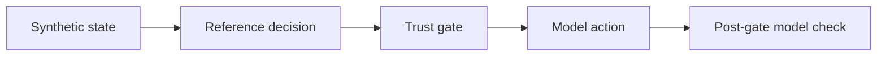

# SEACS Lab

**SEACS — Self-Evolving Autonomous Control System**  
**SEACS Lab v0.1.0 — Public Reference Simulator**

[](https://github.com/IgorRybakoff/seacs-lab/actions/workflows/tests.yml)
[](LICENSE)

Deterministic TypeScript public reference implementation for studying bounded autonomous-control decisions under synthetic microservice failures.

**Status:** public reference v0.1.0 · experimental · no production integration.

SEACS is the broader research architecture. SEACS Lab is its public, runnable reference simulator focused on bounded decisions, explicit trust gates, replayable evidence, and post-gate verification.

## Research question

Can a deterministic controller keep proposed mitigation actions behind an explicit trust gate as evidence quality degrades, while preserving a replayable separation between the initial state, the model proposal, and the post-gate model state?

## Experimental setup

| Component | Public v0.1 |
| --- | --- |
| Failure domain | Synthetic gateway, auth, database, and cache services |
| Scenarios | Stable baseline plus four controlled fault scenarios |
| Determinism | Seed-controlled pseudo-random jitter |
| Evidence profiles | Verified, degraded, conflicted, lost |
| Operating modes | Primary, fallback, heuristic |
| Decision boundary | Five explicit gates from block to execute |
| Actions | No action, rate limit, scale up, isolate, circuit breaker |
| Metrics | Computed by TypeScript only; no LLM-generated metrics |



## Measured reference evidence

The frozen evidence package in [`artifacts/reference_v0.1/`](artifacts/reference_v0.1/) is created by executing the TypeScript controller against the committed matrix in [`configs/reference_matrix.json`](configs/reference_matrix.json). Replay recomputes every record and requires exact JSON equality.

| Frozen evidence result | Value |
| --- | ---: |
| Executed reference cases | 10 |
| Exact replay matches | 10 / 10 |
| Safety Gate outcomes represented | 5 / 5 |
| LLM-generated metrics | 0 |

This evidence demonstrates deterministic implementation behavior only. It does **not** demonstrate production reliability or real infrastructure recovery.

## Run

Requires Node.js 22 or newer.

```bash
npm ci
npm run dev
```

## Verify

```bash
npm test
npm run build
npm run replay
```

Regenerate the frozen public reference evidence:

```bash
npm run artifacts
npm run replay
```

## Evidence semantics

- `before`: synthetic fault state produced by the reference model.
- `proposed`: result of evaluating the complete model proposal.
- `postGate`: state produced by the same model after applying only gate-permitted actions.
- `modelCheckPassed`: an internal invariant check, not independent external verification.

## Public/private boundary

The repository is a complete, runnable **public reference implementation**. Its coefficients are deliberately simple and illustrative. It does not contain private SEACS research policies, operational thresholds, production heuristics, customer data, infrastructure configuration, or patent-sensitive implementations. See [`docs/PUBLIC_PRIVATE_BOUNDARY.md`](docs/PUBLIC_PRIVATE_BOUNDARY.md).

## Limitations

This is not connected to Ray, Kubernetes, Redis, reinforcement learning, an LLM agent swarm, or any production control plane. The dependency paths and fault models are fixed reference scenarios. Read [`KNOWN_LIMITATIONS.md`](KNOWN_LIMITATIONS.md) before interpreting results.

## License

Apache-2.0 applies only to the files in this public reference repository. No rights to unpublished SEACS implementations, policies, or know-how are granted.
